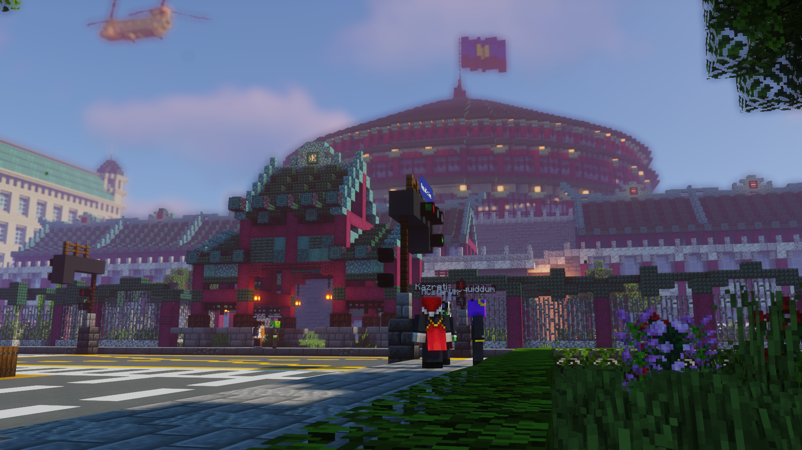

Welcome to kasreti's crib! This is basically where I'll put any long ramblings I have -- but what should you expect here?

## Linguistics and conlangs
I do reading on my own about linguistics quite often, so I'll put any new discoveries that I find cool here and share them. I'll *try* to put more explainer notes around to clarify some terminology since 90% of the people reading this blog will have zero clue about linguistics. You might also see personal advancements in Japanese here.

On the other hand, I'll put a lot of meta updates about the development of Rikatisyï, my main conlang (constructed language -- a language I designed myself); particularly around the grammar, phonotactic changes, historical and dialectal changes, the writing system and just miscellaneous dictionary additions.

*This means presenting this kind of information in a manner humans will understand.*

## Sitaku
I own and play on a Minecraft server called Sitaku, and I do spend a lot of time building cities on there with my friends. This blog will be filled with a lot of personal notes and progress updates on builds on this server, whether that be railway developments or urban planning.

*The parliament building of our server.*

## Games
Aside from Minecraft, I currently play a decent bit of:
* Arcade Rhythm Games: maimai, Sound Voltex, Chunithm and Taiko no Tatsujin
* Factorio
* Balatro

Again, there'll probably be a lot of scoreposting here.

*The grind to 14k continues once more.*

## Chinese calligraphy and typography
I do calligraphy in my spare time, so if anything ever ends up looking decent, it'll go here. I'm also into Chinese typography, so I might have posts dedicated to just nitpicking calligraphy and different fonts.

*Wrote the faichuns for CNY this year.*

## Other things
I'll also post architecture and signange things occasionally. I'm still waiting for NS, so I do want to pick up a skill or two since I'm bored. You might see me make this my progress diary for drawing. You'll never see me ramble about music or shows here though.

#### About the site
I wrote the site myself, using Hugo and the theme hugo-blog-awesome (incredible name), with some minor changes to fonts.